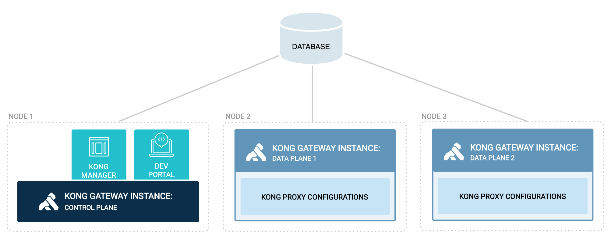

# Kong Enterprise Architecture

In this architecture, we have two components, the Data Plane and the Control Plane. All the images we are using for
Kong are the Enterprise Images.

The Kong Ingress controller is deployed in the Control Plane statefulset as a Sidecar.

The Kong Data Plane is deployed as a daemonset, all the Kong Data Plane reads the configurations from the DB.



This deployment is a turnkey solution, you can eventually change some configurations like the service that is
exposing the kong ingress in the cluster and some fine-tuning in the kong gateway.
You will need to add the correct `secrets` like the Kong `license`.

There are also two more service exposed, one for the Kong Manager and Kong Admin API and one for the
Developer Portal and Developer Portal API.

## Upgrades

When upgrading Kong to a new minor version, you need to run two jobs.
Delete the existing job using:

```bash
kubectl delete job kong-migrations
```

Then **patch** the migration with the `migrations up` command:

```yaml
---
apiVersion: batch/v1
kind: Job
metadata:
  name: kong-migrations
  namespace: kong
spec:
  template:
    spec:
      containers:
        - name: kong-migrations
          command: [ "/bin/sh", "-c", "kong migrations up" ]
      restartPolicy: OnFailure
```

Wait for the job to finish and delete it:

```bash
kubectl delete job kong-migrations
```

Now **patch** the migration with the `migrations finish` command:

```yaml
---
apiVersion: batch/v1
kind: Job
metadata:
  name: kong-migrations
  namespace: kong
spec:
  template:
    spec:
      containers:
        - name: kong-migrations
          command: [ "/bin/sh", "-c", "kong migrations finish" ]
      restartPolicy: OnFailure
```

## Development Notes

```bash
echo "mac.local 127.0.0.1" >> /etc/hosts
echo "api.mac.local 127.0.0.1" >> /etc/hosts
echo "manager.mac.local 127.0.0.1" >> /etc/hosts
```

Configuration files:

```bash
KONG_PORTAL_GUI_HOST=manager.mac.local:8080
KONG_PORTAL_API_URL=http://mac.local:8081
KONG_ADMIN_API_URI=http://api.mac.local:9091
KONG_ADMIN_GUI_URL=http://manager.mac.local:8080
```

### KONG_ADMIN_API_URI

```bash
$ kubectl port-forward -n kong svc/kong-admin 9091:8080 &
```

### KONG_PORTAL_GUI_HOST

```bash
$ kubectl port-forward -n kong svc/kong-admin 8080:80 &
```
